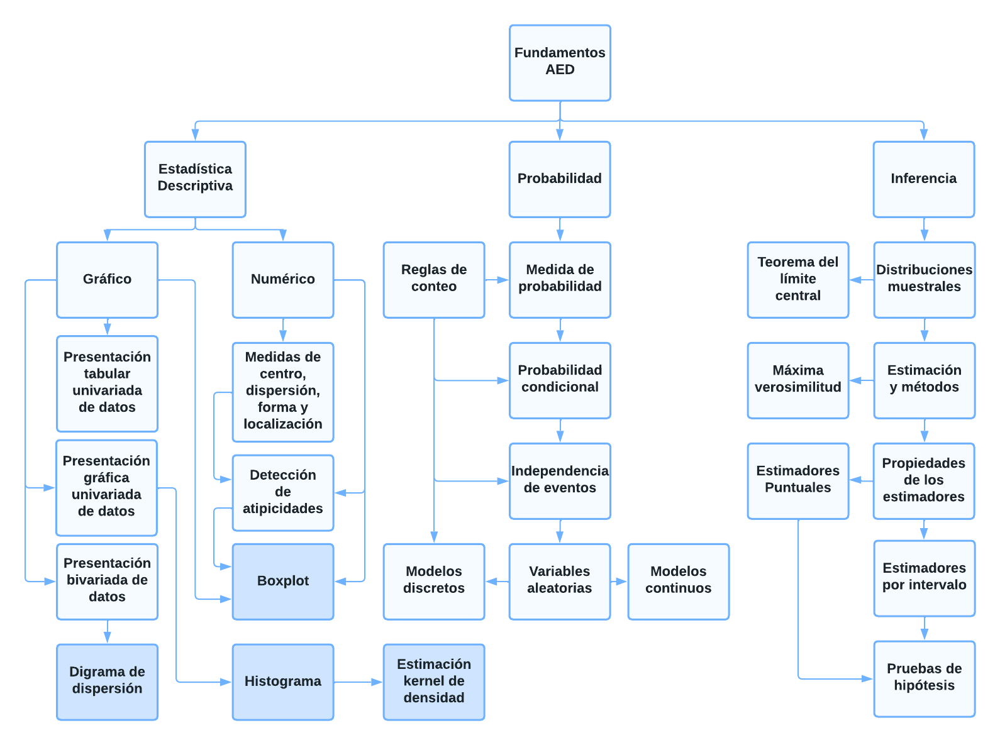
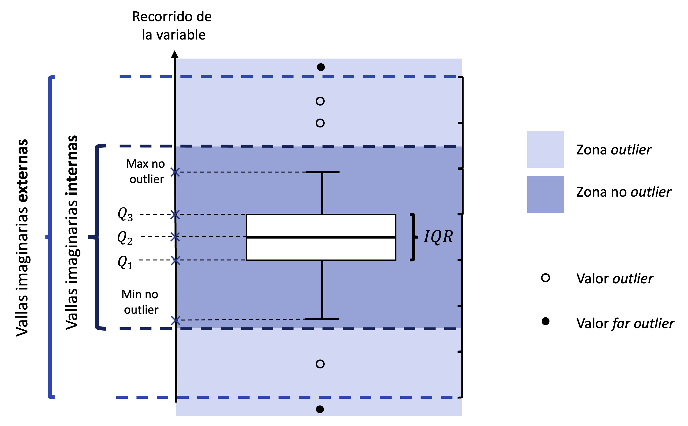

# Dependencias

Para la ejecución de este cuaderno, debe instalar con anterioridad los siguientes paquetes desde la consola de R o usando el menú Tools\>Install Packages en RStudio:

-   `install.packages("tidyverse")`.
-   `install.packages("rmdformats")`.
-   `install.packages("ggExtra")`.

# Objetivo y alcance

**Objetivo**: este cuaderno presenta un resumen de las herramientas estadísticas básicas necesarias para el desarrollo del curso de Análisis Estadístico de Datos (AED). El objetivo principal es revisar las habilidades estadísticas fundamentales para posteriormente continuar con el entendimiento de las herramientas multivariadas más avanzadas.

**Alcance**: siga el desarrollo del cuaderno, ejecute los comandos contenidos y desarrolle los ejercicios propuestos.

# R, R Markdown y paquetes

El desarrollo del curso a partir del lenguaje de programación en R se presenta como una valiosa oportunidad para aprender un [lenguaje orientado al análisis estadístico](https://www.r-project.org/about.html). Múltiples procedimientos y rutinas estadísticas están listas para ser usadas en este lenguaje, el cual es utilizado frecuentemente tanto en investigación como en la industria. Los comandos R son guardados en **scripts** (formato .r), los cuales son archivos en texto plano (archivo conformado únicamente por caracteres, sin formato de estilo alguno) que contienen una colección de instrucciones a ser interpretadas. A continuación una concatenación de valores junto al cálculo de frecuencias absolutas:

```{r}
datos = c(1,3,2,4,5,3,6,8,7)
frq   = table(datos)
```

Puede observarse que el script define al objeto `datos` y mediante la función `table()` se nombra a `frq` como la tabulación de las frecuencias absolutas para `datos`. Esta lista de comandos no es más que texto en el script, es la **consola** de R que lo interpreta y permite imprimir el resultado con la función `print()`

```{r}
print(frq)
```

Una gran cantidad de manuales y tutoriales de programación en R pueden encontrarse en la web. Invitamos a los estudiantes a reforzar continuamente sus habilidades en el lenguaje. Es importante destacar que R es un software libre que además se mantiene en constante crecimiento a través de [paquetes](https://cran.r-project.org/web/packages/available_packages_by_name.html) desarrollados por sus colaboradores, los cuales básicamente son extensiones opcionales de las funcionalidades base del programa. Una colección particular de paquetes que permite una interacción amigable con el lenguaje de programación R es denominado [tidyverse](https://www.tidyverse.org/). Este conjunto de paquetes está especialmente diseñado para facilitar la realización de tareas diarias en la ciencia de datos, tales como: manipulación y lectura de datos, graficación efectiva, entre otros. Una vez instalado (mediante el comando `install.packages("tidyverse")` en la consola), este es cargado en el ambiente del trabajo mediante:

```{r}
library(tidyverse)
```

------------------------------------------------------------------------

### Ejercicio 1

> Instale el paquete `ggExtra` desde la consola de R o desde la interfaz de R Studio.

```{r}
### Escriba su solución aquí
```

------------------------------------------------------------------------

Aunque R es una herramienta poderosa en el análisis de datos, por si sola carece de un ambiente de trabajo para la documentación y presentación efectiva de resultados. Al hacer uso en RStudio de los [R Markdown](http://rmarkdown.rstudio.com) podemos crear documentos técnicos (como el presente documento) junto a la ejecución de scripts de trabajo R en un solo archivo. Por ejemplo, el presente documento es elaborado como una mixtura de comandos en R y sintaxis en lenguaje [markdown](https://www.markdownguide.org/basic-syntax/) (formato .rmd), que una vez compilado, permite una presentación estilizada en formato HTML. Nuevamente, una amplia gama de manuales pueden encontrarse en la web y se motiva a los estudiantes a desarrollar sus habilidades en la elaboración de documentos en R markdown.

# Datos

Para el desarrollo del siguiente cuaderno, se trabaja con una colección de datos abiertos de las naciones unidas [UNdata](http://data.un.org/Host.aspx?Content=About). Estos datos contienen una gran variedad de información recopilada por agencias internacionales para el uso de la comunidad global. Los datos disponibles cubren una amplia variedad de temáticas, entre estas, el consumo de carbón en hogares y la producción de carbón para múltiples naciones o áreas a nivel mundial.

## Lectura de datos

Se definen los datos de consumo de carbón en hogares (`charcoal_chh19`) y de producción de carbón (`charcoal_prd19`) para el año 2019:

```{r}
data_charcoal  = read_csv("UNdata_Charcoal.csv",show_col_types = FALSE)
charcoal_chh19 = data_charcoal %>% 
                 filter(Year==2019 & Commodity=="Charcoal - Consumption by households") %>% 
                 select(-Commodity)
charcoal_prd19 = data_charcoal %>% 
                 filter(Year==2019 & Commodity=="Charcoal - Production") %>% 
                 select(-Commodity)
```

Usualmente, el primer paso en el análisis es entender qué representa cada una de las filas y columnas del conjunto de datos. Esta información normalmente se alberga en el **diccionario de variables** (de estar este disponible). En este caso, esta descripción se verá desarrollada de manera natural más adelante en el cuaderno, por lo cual no se presenta en este momento.

# Definiciones básicas

## Unidad estadística (UE)

Individuo u objeto en el que se mide una variable. Resulta una medición o dato cuando una variable se mide en una unidad experimental. Con las UE entendemos el fenómeno de interés. Para los datos de las naciones unidas, las UE en cada fila albergan un país-área. A continuación los registros para la UE Colombia:

```{r}
charcoal_prd19 %>% filter(Country_Area == "Colombia")
```

------------------------------------------------------------------------

### Ejercicio 2

> Determine el número total de UE en el conjunto de datos `charcoal_chh19` y `charcoal_prd19`.

```{r}
### Escriba su solución aquí
```

> ¿Cuántos países-areas se encuentran en ambos conjuntos de datos?

```{r}
### Escriba su solución aquí
```

------------------------------------------------------------------------

## Variable, dato y medición

***Variable***. Característica que cambia o varía con el tiempo y/o para las diferentes UE. Para los datos `charcoal_prd19`, se tienen las siguientes variables:

-   Country_Area. País o área en la que se mide la producción de carbón.
-   Year. Año de medición.
-   Unit. Unidad de medición en la que se mide la producción de carbón.
-   Quantity. Cantidad total de producción de carbón.

***Dato u observación***. Cuando una variable se **mide** en un conjunto de UE, resulta un conjunto de observaciones o de datos. Usualmente configuramos los datos en tablas, dónde las filas corresponden a las UE y las columnas corresponden a las variables medidas (como en `charcoal_prd19` y `charcoal_chh19`).

***Medición***. Es un proceso de asignación de un valor a las características de interés de las UE. Esta medición puede ser bastante concreta (como la producción de carbón en toneladas métricas de un país) o bastante abstracta (como el coeficiente intelectual de un país).

------------------------------------------------------------------------

### Ejercicio 3

> Diga si la columna `Unit` es una variable o una constante para los dos conjuntos de datos.

```{r}
### Escriba su solución aquí
```

------------------------------------------------------------------------

## Clasificación de variables

### Escala

En general, al medir una variable, los datos observados pueden clasificarse en dos clases: variables de tipo cualitativo (mide atributos o cualidades y se representa mediante *categorías*) o cuantitativo (mide cantidades y se representa mediante *números*). Esta primera clasificación intuitiva puede refinarse mediante la clasificación por escala de las variables. En esta, se nota que al observar una variable, podemos encontrar una diferenciación en la ''forma'' en la cual la medimos (más allá de ser de tipo cualitativo o cuantitativo). Esta clasificación induce un mayor nivel de sofisticación en la medición y define cuatro categorías de variables:

-   Nominal (cualitativa). Ej: Unidad de masa en la que se mide la producción de carbón.

    -   Relación de **igualdad - desigualdad**: Dos países con producción de carbón en toneladas tienen *la misma* unidad de masa en la medición. Un país con producción de carbón en kilogramos y otro en toneladas tienen *diferente* unidad de masa.

-   Ordinal (cualitativa). Ej: Categorías de consumo de electricidad en hogares (alto, medio, bajo).

    -   Relación de igualdad - desigualdad + **Orden**. Además de la relación de igualdad y desigualdad entre los valores alto, medio y bajo de las categorías de consumo de energía, se tiene que un hogar con categoría de consumo alto de energía tiene *mayor* categoría de consumo que un hogar de categoría de consumo bajo. Además, un hogar con categoría de consumo medio de energía tiene *menor* categoría de consumo que un hogar de categoría de consumo alto.

-   Intervalo (cuantitativa). Ej: Temperatura en grados centígrados luego de la instalación de turbinas eólicas.

    -   Relación de igualdad - desigualdad + Orden + **Cero relativo**. Además de las relaciones anteriores, se tiene que los intervalos en cualquier punto de la escala tienen el mismo significado. Si en tres zonas A, B y C el aumento de temperatura fue de 15°C, 13°C y 11°C respectivamente, la diferencia en temperatura entre las zonas A y B es la misma que la diferencia entre las zonas B y C. La particularidad de esta escala es que asigna el valor 0 sin ausencia de la característica, es decir, tiene *cero relativo* (por ejemplo puede verse una temperatura de 0°C, que no implica ausencia de temperatura), y aún así cumplir la equidistancia entre intervalos.

-   Razón (cuantitativa). Ej: Cantidad total de producción de carbón en toneladas métricas.

    -   Relación de igualdad - desigualdad + Orden **+ Cero absoluto**. Además de las relaciones anteriores, se tiene que las razones en cualquier punto de la escala tienen el mismo significado. Si en tres zonas X, Y y Z la cantidad total de producción de carbón en toneladas métricas es de 40°C, 20°C y 10°C respectivamente, la zona X produjo el doble de la zona Y, mientras que la zona Z produjo la mitad de lo que produjo la zona Y. La particularidad de esta escala es que asigna el valor 0 con ausencia de la característica, es decir, tiene *cero absoluto* (por ejemplo una producción 0 toneladas métricas implica ausencia de producción), esta propiedad permite la comparación de razones.

### Clase

Las variables cuantitativas pueden subdividirse en dos clases, dependiendo del **recorrido** de la variable:

-   Discreta. Toma valores en un conjunto discreto, que no necesariamente es finito:

    -   Número de turbinas eólicas instaladas en el país (valor finito).
    -   Número de exploraciones de campo necesarias para ubicar una turbina eólica que produzca mas de 10 millones de kWh anuales (posible valor infinito).

-   Continua. Toma valores en un conjunto continuo, que puede ser un subconjunto de los números reales:

    -   Tiempo de funcionamiento de una turbinas eólica (valor real positivo).

A su vez, las variables cualitativas pueden subdividirse en dos clases, dependiendo también del **recorrido** de la variable:

-   Dicotómicas o binarias: toman dos posibles valores.

    -   Presencia de turbinas eólicas en el pais - área (posibles valores {Si,No}).

-   Politómicas: toman más de dos posibles valores

    -   Principal fuente de energía renovable utilizada en el país -área (posibles valores {Solar,Eólica,Biomasa,Geotermal,Otra,Ninguna}).

### Dimensión

Resultan datos **unidimensionales** cuando se mide una sola variable para cada UE. Resultan datos **bidimensionales** cuando se miden dos variables por unidad experimental. Resultan datos **multidimensionales** cuando se miden más de dos variables en las UE.

# Fundamentos del curso

Para el análisis de datos multidimensionales, una variedad de herramientas estadísticas básicas se encuentran de manera recurrente. Esta colección de temáticas se resume de manera gráfica en el diagrama a continuación:

{#id .class width="100%" height="100%"}

Se destacan por su relevancia en azul oscuro cuatro temas del módulo de estadística descriptiva desarrollados brevemente en las siguientes subsecciones.

## Histograma

Esta herramienta ampliamente utilizada en el análisis descriptivo de datos univariados permite una representación sucinta de la variable de interés. Es utilizado para analizar la distribución univariada de datos cuantitativos (tanto en escala de intervalo como de razón). El histograma no es mas que una versión continua del conocido diagrama de barras, con dos grandes diferencias:

-   Las barras adyacentes se tocan entre ellas (para enfatizar la continuidad de la escala de medida).

-   La variable subyacente, al ser cuantitativa (y no cualitativa como en el diagrama de barras) necesita ser **discretizada**. Esto, en resumen, significa dividir el recorrido de la variable en intervalos, llamados **intervalos de clase**, y caracterizar cada observación, no por su valor observado, sino por el intervalo al que la observación pertenece.

Una vez discretizada la variable, la frecuencia absoluta o relativa es medida para cada intervalo de clase de la variable. El gráfico consiste en ubicar en el eje $x$ el recorrido de la variable y en el eje $y$ la frecuencia observada para cada una de las clases. En la figura se presenta el histograma para la cantidad total de producción de carbón en el año 2019:

```{r}
hist(charcoal_prd19$Quantity,
     main = 'Histograma de producción de carbón por países-áreas\nAño 2019',
     xlab = 'Intervalos de clase - Producción (en miles de toneladas métricas) de carbón',
     ylab = 'Frecuencia absoluta')
```

Se puede apreciar con el gráfico que la distribución de los datos está caracterizada por bajos valores para la variable. Es decir, la producción de carbón para los diferentes países considerados tiende a ser baja (es importante recordar que la variable está medida en miles de toneladas métricas). Adicionalmente, esta presenta una alta dispersión respecto al centro de la distribución (ubicado aproximadamente entre 0 y 500 mil toneladas métricas, de acuerdo con el gráfico). Existen zonas con una producción atípicamente alta de carbón, particularmente a la derecha de la distribución, por lo que dicha variable presenta un claro sesgo a la derecha. Esta primera descripción general es muy valiosa y fácilmente interpretable a partir del gráfico: al sacrificar la individualidad de cada dato continuo y discretizarlo en su intervalo de clase correspondiente, podemos ganar interpretabilidad en la distribución de los datos mediante el gráfico de histograma. Sin embargo, este presenta al menos dos problemas importantes:

-   No es claro cuál es el valor máximo de la variable, tampoco el mínimo. La centralidad de los datos con la descripción dada es demasiado gruesa (el intervalo de 0 a 500 toneladas métricas) y la dispersión tampoco es clara. Finalmente, se sabe que hay valores atípicamente altos, pero no existe un criterio alguno para definir atipicidades. Estas características resultan en estadísticas resumen de gran importancia para entender la distribución de los datos las cuales se pierden al elaborar el histograma.

-   La discretización mencionada requiere decidir el número $k$ de intervalos de clase y el histograma es sensible al valor de $k$. En este caso, R decide por nosotros el número de clases del gráfico a partir de una regla determinística (llamada regla de Sturges), y se espera que dentro de cada intervalo el comportamiento de la variable sea aproximadamente homogéneo. Sin embargo:

    -   No existe una única regla para obtener el número de clases, y cada una puede resultar en diferentes valores de $k$.
    -   Ninguna de estas reglas asegura un comportamiento homogéneo en cada uno de los intervalos de clase.

------------------------------------------------------------------------

### Ejercicio 4

> Para el conjunto de datos de consumo de carbón (`charcoal_chh19`), elabore un histograma para la variable `Quantity` mediante la regla de Sturges (indique claramente los ejes y el título del gráfico). ¿Cuál es la marca de clase del intervalo modal?

```{r}
### Escriba su solución aquí
```

------------------------------------------------------------------------

## Boxplot

Para el primer problema, podríamos solucionarlo parcialmente identificando las estadísticas resumen y agregarlas como líneas verticales en el gráfico:

```{r fig.align = "center"}
hist(charcoal_prd19$Quantity,
     main = 'Histograma de producción de carbón por paises - áreas\nAño 2019 - con estadísticas resumen',
     xlab = 'Intervalos de clase - Producción (en miles de toneladas métricas) de carbón',
     ylab = 'Frecuencia absoluta')

abline(v = max(charcoal_prd19$Quantity),col='yellow')
abline(v = mean(charcoal_prd19$Quantity),col='blue')
abline(v = min(charcoal_prd19$Quantity),col='red')
```

La media (en azul) y los valores extremos (máximo en amarillo, mínimo en rojo) de los datos son añadidos al gráfico. Estos detalles presentan una mejora ante el gráfico anterior, sin embargo, otras características relevantes aún siguen sin ser apreciadas, como por ejemplo la dispersión y la existencia de atipicidades. Antes de pensar en seguir acumulando características adicionales en el histograma, una mejor alternativa es resumir los datos en estadísticas descriptivas en lugar de intervalos de clase. Esto permitiría apreciar las características cuantitativas de interés de los datos. A partir de 5 números que resumen de manera concreta la distribución de una variable cuantitativa, el boxplot o gráfico de caja permite lograr este objetivo. Las estadísticas resumen son las siguientes:

-   $x_{(n)}$ (máximo): localización.
-   $Q_3$ (cuartíl 3): localización.
-   $Q_2$ (cuartíl 2 o mediana): centro y localización.
-   $Q_1$ (cuartíl 1): localización.
-   $x_{(1)}$ (mínimo): localización.

Note que en función de $Q_1$ y $Q_3$ puede definirse el rango intercuartílico $IQR=Q_3-Q_1$, el cual es una medida de dispersión de los datos. Por último, para detectar datos atípicos o **outliers**, es necesario construir reglas de referencia o vallas outlier:

-   Vallas imaginarias internas: $[Q_1−1.5 IQR , Q_3+1.5 IQR]$.

-   Vallas imaginarias externas: $[Q_1−3.0 IQR , Q_3+3.0 IQR]$.

Con lo cual

-   Si una observación se encuentra dentro de las vallas, es una observación usual.
-   Si una observación está fuera de las vallas internas, pero dentro de las externas, es llamada outlier.
-   Si una observación está fuera de las vallas externas, es llamada far outlier.

La definición de las vallas es un estándar de referencia generalmente aceptado. En la actualidad, no es muy común distinguir entre outliers and far outliers, por lo cual se llama atípico ó outlier a un dato outlier ó far outlier. En R, por ejemplo, no se hace distinción entre estos dos tipos de atipicidades.

Las características previamente descritas se pueden visualizar de manera conjunta en el boxplot. En el recorrido de la variable se ubican las medidas resumen descritas y se visualizan en forma de **caja**, esta escala es usualmente ubicada en el eje $y$ (al cambiar la ubicación del recorrido de la variable para el eje $x$, la orientación del gráfico resulta horizontal sin pérdida de información alguna). A continuación se muestra un esquema que resume el proceso:

{#id .class width="100%" height="100%"}

Se evidencian además los **bigotes** del diagrama, los cuales se extienden hasta la máxima (y mínima) observación no outlier. Estos permiten, con ayuda de la caja, determinar características de forma (simetría y apuntamiento) en los datos. En conjunto, el análisis del boxplot permite de manera gráfica y a partir de la descripción numérica de los datos, un entendimiento de la centralidad, localización, dispersión, forma y atipicidades de los datos cuantitativos univariados.

Al ubicar los dos gráficos en una misma escala (note que el gráfico de boxplot fue orientado horizontalmente para contrastar fácilmente con el histograma) es evidente que el boxplot presenta una alternativa mucho más informativa que el histograma. Adicional a lo concluido para el histograma, con el boxplot se puede observar que el primer intervalo de clase del histograma contiene una gran cantidad de información que de por si no es homogénea: tanto $Q_1$ como $Q_2$ se encuentran muy cerca al origen, indicando que cerca de la mitad de los datos estarían concentrados en el límite inferior del intervalo de clase. El $Q_3$ se encuentra también dentro del primer intervalo de clase, cercano al límite superior, implicando que al menos el 75% de los datos se encuentra en dicho intervalo, con una mayor concentración al inicio de dicho intervalo. Al existir este fuerte sesgo, la media y la mediana como medidas de tendencia central resultan significativamente diferentes, haciendo que la mediana represente mejor la centralidad de los datos. Se nota además que se considera atípica una producción de carbón justo antes de las 1000 toneladas métricas.

```{r fig.align = "center", fig.height=10,fig.width=10 }
par(mfrow=c(2,1))
hist(charcoal_prd19$Quantity,
     main = 'Histograma de producción de carbón por paises - áreas\nAño 2019 - con estadísticas resumen',
     xlab = 'Intervalos de clase - Producción (en miles de toneladas métricas) de carbón',
     ylab = 'Frecuencia absoluta',
     xlim = c(0,6500))

abline(v = max(charcoal_prd19$Quantity),col='yellow')
abline(v = mean(charcoal_prd19$Quantity),col='blue')
abline(v = min(charcoal_prd19$Quantity),col='red')

boxplot(charcoal_prd19$Quantity,horizontal = TRUE,ylim = c(0,6500),
        main = 'Boxplot (orientacíon horizontal) de producción de carbón por paises - áreas\nAño 2019',
        xlab = 'Producción (en miles de toneladas métricas) de carbón')
```

------------------------------------------------------------------------

### Ejercicio 5

> Para el conjunto de datos de consumo de carbón (`charcoal_chh19`), elabore un boxplot para la variable `Quantity` (indique claramente los ejes y el título del gráfico). ¿Es similar al boxplot para la misma variable en el conjunto de datos `charcoal_prd19`?

```{r}
### Escriba su solución aquí
```

> ¿Cuántos países-áreas tienen un consumo atípico de carbón de acuerdo con el boxplot realizado en el punto anterior? Ayuda: Defina el gráfico como un objeto en el ambiente de R y extraiga de este (mediante el símbolo \$) los índices de los valores atípicos. Luego determine la cantidad de índices atípicos.

```{r}
### Escriba su solución aquí
```

------------------------------------------------------------------------

## Estimación kernel de la densidad

### Densidad

Usualmente asumimos que los datos observados provienen de un proceso aleatorio, el cual es cuantificado por una variable aleatoria que a su vez es caracterizada por una función de densidad de probabilidad (fdp, para variables de tipo continuo) o una función másica de probabilidad (fmp, para variables de tipo discreto). La fdp es una función que rige las características de tipo probabilístico de la variable. Esta función toma los valores del recorrido de la variable aleatoria de interés en el eje $x$, mientras que en el eje $y$ presenta la correspondiente **densidad** de cada punto, la cual representa que tan **verosímiles** son los valores de la variable.

### Estimación kernel de la densidad

El segundo problema mencionado en la elaboración del histograma se relaciona con el número de clases $k$. Se nota que en efecto para nuestros datos el número de intervalos de clase representa diferencias en las distribuciones presentadas.

```{r fig.align = "center"}
par(mfrow=c(2,3))
for(k in c(5,10,25,50,75,100)){
hist(charcoal_prd19$Quantity,breaks=k,
     main = paste0('Histograma de producción de carbón\npor paises - áreas. Año 2019 - k = ',k),
     xlab = 'Intervalos de clase - Producción\n(en miles de toneladas métricas) de carbón',
     ylab = 'Frecuencia absoluta')
}
```

Asumimos que existe una única distribución subyacente generadora de los datos, sin embargo los gráficos previamente presentados muestran distribuciones diferentes sobre el mismo conjunto de datos. Las distribuciones con un $k$ menor parecen suavizar características importantes en los datos (como lo vimos previamente para el histograma con la regla de Sturges, cuyo primer intervalo de clase de por sí contenía una distribución en sus datos altamente sesgada a la derecha). Por otra parte, a medida que crece $k$, el histograma se ve **ruidoso** y parece sobreajustarse a los datos. Naturalmente se preguntaría por el número óptimo $k$ para obtener aquella distribución que en efecto representa la realidad que muestran los datos, sin sobreajustar ni sobresuavizar la distribución de los datos.

A través del histograma se puede aproximar la fdp de la variable aleatoria continua subyacente. En R haciendo uso de la función `hist()` con `prob=TRUE` obtenemos la estimación de la fdp para la variable de interés (note que ahora definimos al histograma como un objeto en el ambiente de trabajo de R):

```{r}
h_dens = hist(charcoal_prd19$Quantity,prob=TRUE,
         main = 'Histograma de producción de carbón por paises - áreas\nAño 2019',
         xlab = 'Intervalos de clase - Producción (en miles de toneladas métricas) de carbón',
         ylab = 'Densidad')
```

Ahora en el eje $y$ se tiene una estimación de la densidad de la distribución. Como puede observarse, si sumamos el área gris del gráfico obtenemos que esta es igual a uno (que por cierto, es verdadero para cualquier valor de $k$). Esta es una propiedad de cualquier fdp, cuya área bajo la curva, o **integral**, es siempre igual a uno :

```{r}
l_base   = diff(h_dens$breaks) # vector con longitud de c/intervalo de clase (base)
l_altura = h_dens$density      # vector con densidad estimada para c/intervalo de clase (altura)
sum(l_base*l_altura)           # área total de todos los rectángulos del histograma
```

Esta propiedad nos permite medir el chance de ocurrencia de eventos de la variable aleatoria de interés. Por ejemplo, conocer la probabilidad del evento $A$='Selección de un país-área con producción de carbón (en miles de toneladas métricas) entre 1000 y 1500' como el área (o integral) de la fdp entre los valores $x=1000$ y $x=1500$. Que para la estimación de la fdp mediante el histograma, esta probabilidad como porcentaje es igual a:

```{r}
base_1000_1500 = 500
altu_1000_1500 = h_dens$density[h_dens$mids == 1250]
prob_A_hist    = base_1000_1500 * altu_1000_1500
round(100*prob_A_hist,2)
```

------------------------------------------------------------------------

### Ejercicio 6

> Calcule la la probabilidad como porcentaje del evento $B$='Selección de un país-área con producción de carbón (en miles de toneladas métricas) entre 0 y 500' para la estimación de la fdp mediante el histograma.

```{r}
### Escriba su solución aquí
```

------------------------------------------------------------------------

A partir de la estimación kernel de la densidad (KDE por sus siglas en inglés), en lugar de estimar la densidad como una constante para los datos en cada intervalo de clase de un histograma, calculamos un promedio en cada punto del recorrido de la variable. Este es un promedio ponderado de todas las observaciones, que da más importancia a las observaciones cercanas al punto y menos a aquellas que se encuentran más alejadas de este. Resumimos entonces los datos como promedios ponderados en su vecindad.

```{r}

hist(charcoal_prd19$Quantity, # Histograma
     prob = TRUE, ylim=c(0,0.0030),xlim=c(-4,6500),
     main = 'Histograma con KDE de producción de carbón por países - áreas\nAño 2019',
     xlab = 'Producción (en miles de toneladas métricas) de carbón',
     ylab = 'Densidad')
lines(density(charcoal_prd19$Quantity), # Densidad
      lwd = 2,col = "red")

```

Para esta estimación de la densidad obtenemos una representación más precisa que la observada mediante el histograma. Vemos en particular que el primer intervalo de clase no presenta una densidad homogénea, esta es artificialmente generada por la discretización necesaria en la elaboración del histograma. En realidad, la probabilidad del evento $A$ descrito anteriormente está claramente sobreestimada mediante la estimación de la fdp del histograma. Se nota además que en ningún momento se especificó el número de intervalos. Sin embargo, se destaca que la implementación de este método no considera que la variable de interés es siempre mayor o igual a cero, por lo cual asigna una densidad importante a valores negativos dado el marcado sesgo de la variable. Además, hay un par de decisiones por defecto tomadas en R (el kernel $k$ y el ancho de banda $h$), las cuales modifican significativamente la estimación de la densidad, pero salen del alcance de la presente introducción al curso.

------------------------------------------------------------------------

### Ejercicio 7

> Para el conjunto de datos de consumo de carbón (`charcoal_chh19`), elabore la estimación kernel de la densidad para la variable `Quantity`. ¿Es similar al boxplot para la misma variable en el conjunto de datos `charcoal_prd19`?

```{r}
### Escriba su solución aquí
```

> Calcule el área bajo la curva de la estimación de la densidad del punto anterior. Ayuda: aproxime el área de la curva como la suma de áreas de los rectángulos que la contienen. Para esto, defina el gráfico como un objeto en el ambiente de R y extraiga de este (mediante el símbolo \$) la estimación de la verosimilitud y la colección correspondiente de valores en el dominio (eje x).

```{r}
### Escriba su solución aquí
```

------------------------------------------------------------------------

## Diagrama de dispersión

### Pensamiento bivariado

En los ejemplos desarrollados hasta ahora nuestras observaciones han sido números o escalares, estas observaciones univariadas corresponden a una muestra fija de observaciones de una población determinada. Estas generalmente se notan como $x_1$,...,$x_n$ dónde $n$ representa el tamaño muestral y $x_i$ (una observación arbitraria pero fija), representa para nuestro ejemplo la producción (en miles de toneladas métricas) de carbón del $i$-ésimo país o área. Por ejemplo $x_2$ es igual a $1159.8$ y corresponde al país-área de Angola:

```{r}
charcoal_prd19$Quantity[2]
charcoal_prd19$Country_Area[2]
```

En el análisis bivariado, nuestras observaciones son ahora vectores de dimensión dos. En notación estadística, ahora contamos con parejas ordenadas $(x_1,y_1)$,...,$(x_n,y_n)$. Continuando el ejemplo:

```{r}
charcoal_bivar = (charcoal_prd19 %>% select(Country_Area,Charcoal_Production=Quantity)) %>% 
                 inner_join(charcoal_chh19 %>% select(Country_Area,Charcoal_Consumption=Quantity),by='Country_Area')

charcoal_bivar %>% filter(Country_Area == 'Argentina')
```

En este caso, la observación $(x_3,y_3)=(411,247)$ corresponde a Argentina y podemos ver que el país produce más carbón del que consume. Esto tiene sentido al ser Argentina uno de los pocos países productores de carbón de la región. En el análisis bivariado, como acabamos de notar, estamos interesados en la relación u asociación entre las dos variables, es decir, las características de la distribución **conjunta** de las variables, en lugar de la distribución **marginal** de cada variable de manera independiente. Sin embargo, no estamos interesados en una sola instancia o caso aislado, buscamos ver a través de los datos la relación existente entre las variables.

### Diagrama de dispersión

Para finalizar esta introducción, concluímos con una herramienta gráfica importante en el estudio de la relación entre variables de tipo cuantitativo. El diagrama de dispersión presenta las parejas de observaciones en un plano. Para el diagrama de dispersión, ambas son variables cuantitativas continuas:

```{r}
plot(charcoal_bivar$Charcoal_Production,charcoal_bivar$Charcoal_Consumption,
     main = 'Diagrama de dispersión de consumo y producción de carbón\n por paises - áreas. Año 2019',
     xlab = 'Producción (en miles de toneladas métricas) de carbón',
     ylab = 'Consumo (en miles de toneladas métricas) de carbón')
```

Es evidente la relación lineal y positiva que tienen las dos variables. Este gráfico sirve de base para detectar modelos generadores de las parejas de datos bivariados: tendencias lineales, no lineales, crecientes, decrecientes, heteroscedásticas, entre otros. Adiciones informativas pueden incluirse en el gráfico, por ejemplo, las distribuciones marginales pueden ser incorporadas. A continuación el gráfico de dispersión ampliado, con las distribuciones marginales para cada variable usando los métodos de estimación vistos en la lección: histograma, boxplot y KDE:

```{r}
library(ggplot2)
library(ggExtra)
g_base = ggplot(charcoal_bivar, aes(x = Charcoal_Production,
                                    y = Charcoal_Consumption)) + 
         labs(title="Diagrama de dispersión de consumo y producción de carbón\npor paises - áreas. Año 2019") +
         xlab("Producción (en miles de toneladas métricas) de carbón") + 
         ylab("Consumo (en miles de toneladas métricas) de carbón") +
         geom_point()
```

```{r}
g1 = ggMarginal(g_base, type = "histogram")
g1
```

```{r}
g2 = ggMarginal(g_base, type = "density")
g2
```

```{r}
g3 = ggMarginal(g_base, type = "boxplot")
g3
```

# Conclusiones

-   El objetivo del curso es presentar un conjunto de herramientas estadísticas para analizar datos multidimensionales y construir modelos con aplicación en un amplio espectro de áreas. Para esto, es necesario un entendimiento de las herramientas estadísticas básicas presentadas brevemente en el presente cuaderno.

- Herramientas esenciales univariadas, tales como el histograma y el boxplot, son de gran importancia en la descripción marginal de datos multivariados. Además, algunas definiciones básicas brevemente mencionadas en el presente cuaderno: tales como función de densidad y función de verosimilitud, se visitarán de manera recurrente en el análisis estadístico de datos.

- Los diagramas de dispersión, además de permitir observar relaciones bivariadas entre variables, se utilizarán en la proyección bidimensional de datos multidimensionales bajo diferentes contextos. Es importante una familiaridad con esta herramienta gráfica.

# Referencias

-   Mendenhall, W., Beaver, R. J., & Beaver, B. M. (2012). Introducción a la probabilidad y estadística. Cengage Learning.
